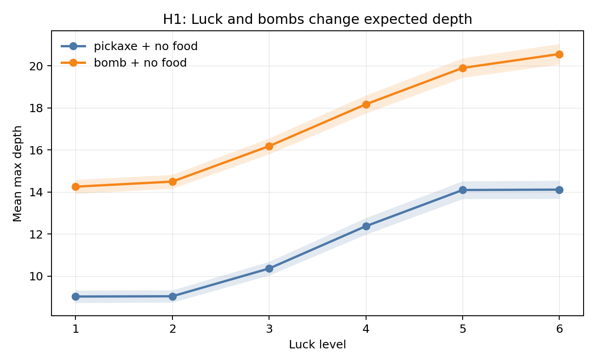
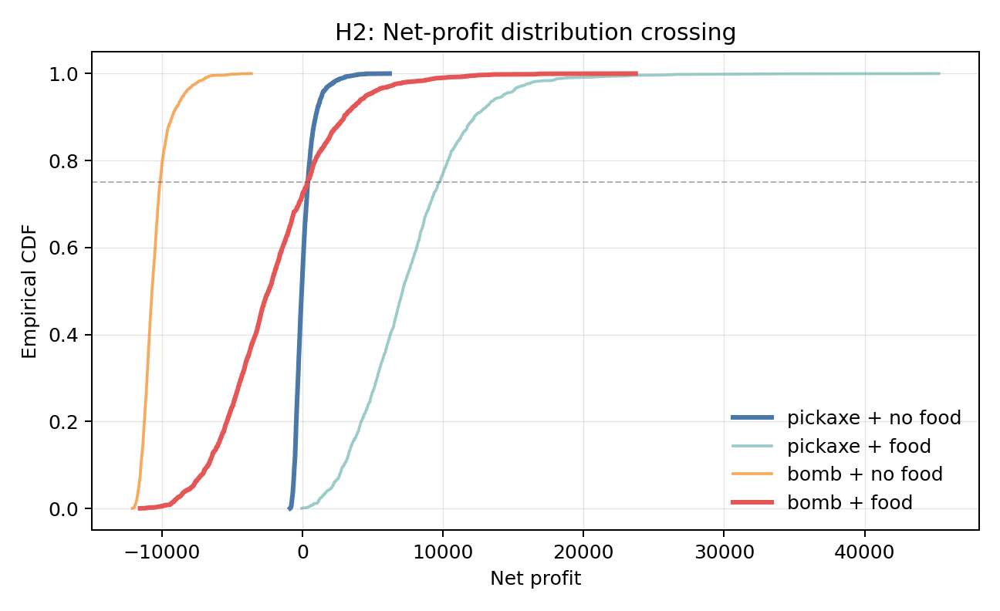
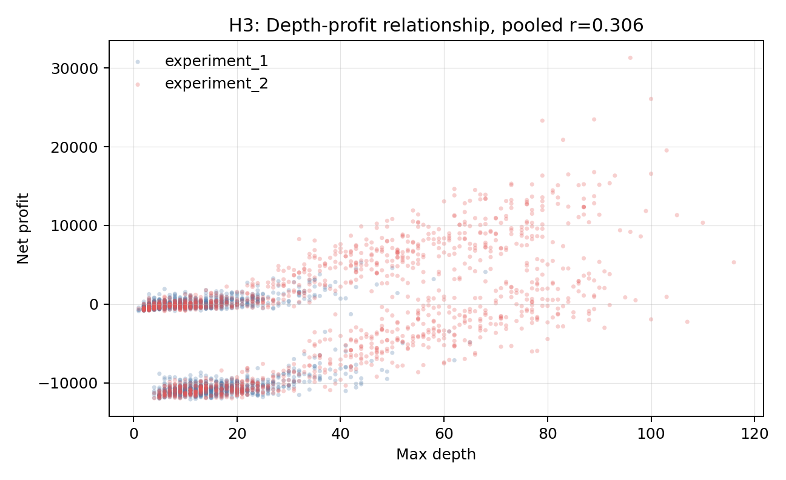

# Stardew Valley Skull Cavern Monte Carlo Simulation

This is the final project for IS597 Program Quality & Analytics, Spring 2026.

## Project Overview

This project is a Type I critique and improvement of a previous IS597 Stardew
Valley mining Monte Carlo project. The original 2022 project had a useful
simulation idea, but the analysis around it was too loose for the conclusions
it tried to make. It relied heavily on raw means, visual convergence checks,
manually edited experiment calls, and run counts that were not justified from
the output variance.

Instead of only patching a few isolated bugs, we rebuilt the project around a
Skull Cavern version of the problem. The new simulation keeps the game setting
but adds a clearer engine structure for time budget, luck-driven exits, bomb
use, food use, monster combat, costs, and final run summaries.

The main goal is not to make a perfect Stardew Valley clone. It is to show a
more defensible Monte Carlo workflow: contract checks, validation, sample-size
reasoning, formal summary tables, and plots tied back to stated hypotheses.
Final H1/H2 experiments use `N=2000` runs per cell, selected from real-engine
Phase 2 validation and targeted N extension.


## Hypotheses

**H1 - Luck vs bomb effect on depth**

Higher luck increases expected floor depth more than bomb usage.

How tested: compare the depth gain from moving `luck_level=1` to `luck_level=6`
with bombs off against the gain from switching from pickaxe to bomb at neutral
luck.

**H2 - Distributional dominance and quantile crossing**

Bomb+food has higher expected profit but higher variance, creating a
risk-return tradeoff. More formally, the bomb+food net-profit distribution was
expected to cross the pickaxe+no-food distribution: worse in low quantiles, but
better in high quantiles.

How tested: compare mean profit, standard deviation, death rate, and the
quantile crossing table for bomb+food versus pickaxe+no-food.

**H3 - Depth to profit correlation**

Deeper floors reached should correlate with higher net profit, because deeper
floors have higher-value ore and monster drops. The planned threshold was a
large positive pooled Pearson correlation, `r > 0.6`.

How tested: pool H1 and H2 simulation outputs and compute Pearson correlation
between `max_depth` and `net_profit`.

## Monte Carlo Phases

### Phase 1 - Random Variables

The simulation randomizes the events that make a Skull Cavern run uncertain based on game mechanics:

- ladder probability
- shaft depth distribution
- rock and resource drops
- monster spawn and combat outcomes
- player survival through HP, food, and time pressure

### Phase 2 - Controls and Experiments

The controlled inputs are the player and strategy settings:

- luck level
- bomb versus pickaxe strategy
- food versus no-food strategy
- strategy cell (`pickaxe_nofood`, `pickaxe_food`, `bomb_nofood`, `bomb_food`)
- validation-backed run count

Phase 2 also includes the validation layer. The point is to avoid running H1/H2
with a guessed sample size.

### Phase 3 - Analysis

The analysis stage turns raw runs into hypothesis evidence:

- expected floor depth by luck and strategy
- net-profit distribution and quantile crossing
- depth-profit correlation
- Welch t, Cohen's d, confidence intervals, and Pearson correlation summaries
- final plots and compact tables in `outputs/`

## Critique of the Original Project

The critique here is mostly methodological. The earlier project was not useless
or careless; it had a real simulation structure. The problem was that the
evidence layer around the simulation was too thin.

| Original project issue | Why it matters | Improvement in this project |
|---|---|---|
| Convergence was judged from a plotted running curve in `if_convergent()` rather than a numeric rule. | A plot can be useful, but it does not say when a run count is enough. | `validation/convergence.py` uses a rolling-window drift rule and writes `outputs/data/validation_convergence.csv`. |
| Trial counts such as 1000 and 500 appeared as experiment settings without sample-size justification. | A Monte Carlo result depends on variance; the same N is not equally convincing for every metric. | `validation/sample_size.py` and `validation/run_phase2.py` sweep N over the actual H1/H2 design cells. |
| Hypothesis conclusions were mainly raw mean comparisons. | Mean-only analysis hides uncertainty, variance, and practical effect size. | `analysis/stats.py` reports Welch t, Cohen's d, mean confidence intervals, and Pearson correlation with CI. |
| Logical validation focused on one correlation check using `np.corrcoef`. | A single correlation without p-value or broader sanity checks is not enough to validate a simulation engine. | `validation/sensitivity.py` checks directional response for luck and bomb strategy. |
| Experiment execution required manual/commented code paths. | Manual toggling makes reproducibility fragile. | H1/H2/H3 are separate runnable modules under `experiments/`, and Phase 2/analysis have command-line module entry points. |
| Output schemas were implicit. | Downstream analysis can silently break when field names drift. | `validation/contract.py` checks required fields such as `seed`, `cell_id`, `luck_level`, `max_depth`, `net_profit`, and `died`. |

There are also code-level issues in the 2022 project, but this project does not
try to present itself as a line-by-line bug patch. The larger improvement is
the new validation and analysis framework around the simulation.

## What We Changed

The rebuilt project separates the work into clearer layers:

- `skull_cavern/`: the real simulation engine for Skull Cavern runs.
- `validation/`: contract checks, mock/real engine validation, convergence,
  sample-size sweeps, sensitivity checks, and targeted N extension.
- `experiments/`: H1/H2/H3 data generation scripts using the validated run
  count.
- `analysis/`: statistical helpers, summary table generation, and final plots.

The most important interface is the run-result contract. Downstream validation
and analysis expect each run row to include:

```text
seed, cell_id, luck_level, max_depth, net_profit, died
```

That small schema check saved time during integration because validation could
fail early when the real engine and analysis pipeline disagreed.

## Phase 2 Validation and N_final

Phase 2 is the bridge between "the engine runs" and "the final experiments have
a defensible sample size." It does not directly prove H1/H2/H3. It checks
whether the engine responds in expected directions and how many runs are needed
before the final experiment outputs are stable enough to use.

The validation happened in three passes:

1. **Framework self-test with a mock engine.** The mock engine was only used to
   test validation code paths. Mock outputs are not final evidence.
2. **Real-engine Phase 2 validation.** The real engine generated
   `outputs/data/validation_convergence.csv`,
   `outputs/data/validation_sample_size.csv`,
   `outputs/data/validation_sensitivity.csv`, and
   `outputs/data/validation_n_final.csv`.
3. **Targeted N extension.** Three cells controlled the first N decision, so
   `validation/targeted_n_extension.py` reran those cells at
   `(1000, 1500, 2000)`.

The first real-engine N decision selected `N=1000` because it was the largest
value in the original grid for several noisy cells. That was a warning, not a
victory lap. The targeted extension then made the tradeoff clearer:

- H1 `pickaxe_nofood`, `luck=3`, `max_depth` was stable enough at `N=1000`.
- H2 `bomb_food`, `net_profit` remained noisy across replicate batches.
- H2 `pickaxe_nofood`, `net_profit` was close to the target by `N=2000`, but
  still not a perfect pass.

The final decision was:

```text
N_final = 2000
```

This is a validation-backed conservative ceiling, not a claim that every profit
cell perfectly converged. That caveat matters. It is also exactly the kind of
uncertainty the original project did not make visible.

The sensitivity check was directionally reasonable:

- `luck_level -> max_depth`: `r=0.99985`, monotonic passed.
- `cell_id_bomb_food -> max_depth`: positive direction passed.

Those sensitivity rows are sanity checks, not formal hypothesis tests.

## Final Results

### H1 - rejected



H1 predicted that the depth gain from luck would be larger than the depth gain
from bombs. The final table does not support that.

From `outputs/tables/h1_effect_summary.csv`:

| Effect | Mean gain | Welch t | p-value | Cohen's d |
|---|---:|---:|---:|---:|
| Luck 1 to 6, bombs off | 5.08 floors | 19.00 | 9.30e-77 | 0.601 |
| Bomb on at luck 4 | 5.80 floors | 19.45 | 1.37e-80 | 0.615 |

Both effects are clearly nonzero, but the bomb effect is slightly larger than
the luck swing under this model. The field `luck_gain_exceeds_bomb_gain` is
`False`, so H1 is rejected.

### H2 - partially supported but mean-profit claim rejected



H2 was the most interesting result because it split into two parts.

The mean-profit claim was rejected. From `outputs/tables/h2_profit_summary.csv`:

| Cell | Mean profit | Std profit | q10 | q50 | q90 | Died rate |
|---|---:|---:|---:|---:|---:|---:|
| pickaxe_nofood | 104.68 | 713.49 | -566.07 | -59.55 | 927.10 | 1.000 |
| pickaxe_food | 7536.51 | 3978.23 | 2958.99 | 7128.40 | 12222.44 | 0.998 |
| bomb_nofood | -10491.28 | 1010.84 | -11488.07 | -10707.50 | -9278.45 | 1.000 |
| bomb_food | -2054.50 | 3994.24 | -6686.56 | -2404.80 | 2968.40 | 0.997 |

Bomb+food did not have higher expected profit. Its mean profit was negative,
mostly because the upfront cost and death penalty are severe.

The distribution-crossing part was supported. From
`outputs/tables/h2_quantile_crossing.csv`, bomb+food is below pickaxe+no-food
through q0.75, then becomes higher by q0.80:

| Quantile | Bomb minus pickaxe | Bomb+food higher? |
|---:|---:|---|
| 0.70 | -536.45 | False |
| 0.75 | -34.20 | False |
| 0.80 | 402.46 | True |
| 0.90 | 2041.30 | True |

So H2 is **partially supported but mean-profit claim rejected**: the upper-tail
upside exists, but the average run is still worse for bomb+food in this model.

### H3 - rejected as stated



H3 expected a large positive pooled correlation between depth and profit
(`r > 0.6`). The pooled result did not reach that threshold.

From `outputs/tables/h3_correlation.csv`:

| Group | n | r | 95% CI low | 95% CI high | Threshold | Passed? |
|---|---:|---:|---:|---:|---:|---|
| pooled | 32000 | 0.306 | 0.296 | 0.315 | 0.6 | False |
| experiment_1 | 24000 | -0.195 | -0.207 | -0.183 | 0.6 | False |
| experiment_2 | 8000 | 0.542 | 0.526 | 0.557 | 0.6 | False |

The result is still informative. Depth helps in some contexts, especially
within H2, but pooled profit is heavily affected by strategy costs and death
penalties. Deeper is not automatically more profitable once strategy is mixed
into the same pool.

## How to Run

Use the project virtual environment on Windows:

```powershell
.\.venv\Scripts\python.exe -m pytest tests\ -v
.\.venv\Scripts\python.exe -m doctest validation\run_phase2.py validation\targeted_n_extension.py analysis\stats.py -v
```

Run Phase 2 validation:

```powershell
.\.venv\Scripts\python.exe -m validation.run_phase2 mock
.\.venv\Scripts\python.exe -m validation.run_phase2 real
.\.venv\Scripts\python.exe -m validation.targeted_n_extension real
```

Run final experiments and analysis:

```powershell
.\.venv\Scripts\python.exe -m experiments.h1_luck_vs_bomb
.\.venv\Scripts\python.exe -m experiments.h2_profit_distributions
.\.venv\Scripts\python.exe -m experiments.h3_depth_vs_profit
.\.venv\Scripts\python.exe -m analysis.run_analysis
.\.venv\Scripts\python.exe -m analysis.plots
```

## Outputs

Key generated outputs:

- `outputs/data/`: raw experiment outputs and real validation CSVs.
- `outputs/tables/`: compact tables used for final interpretation.
- `outputs/figures/`: final H1/H2/H3 plots.

The most important result tables are:

- `outputs/tables/h1_effect_summary.csv`
- `outputs/tables/h2_profit_summary.csv`
- `outputs/tables/h2_quantile_crossing.csv`
- `outputs/tables/h3_correlation.csv`

The final plots are backed by these source tables:

- `outputs/tables/h1_depth_by_luck.csv` feeds
  `outputs/figures/h1_depth_vs_luck.png`.
- `outputs/tables/h2_ecdf_points.csv` feeds
  `outputs/figures/h2_profit_cdfs.png`.
- `outputs/tables/h3_scatter_points.csv` feeds
  `outputs/figures/h3_depth_profit_scatter.png`.

The most important validation tables are:

- `outputs/data/validation_n_final.csv`
- `outputs/data/validation_n_extension_summary_real.csv`
- `outputs/data/validation_n_extension_real.csv`
- `outputs/data/validation_sensitivity.csv`

Mock and fast validation CSVs are kept only as development evidence. They are
not used as final N evidence.

## Appendix A. Simplifying Assumptions

1. Bombs and food are purchased before the run; there are no mid-run purchases.
2. Combat is turn-based between one player and one monster at a time.
3. Equipment is held constant across all runs and hypotheses.
4. A run ends when the player dies or when the in-game time budget is exhausted.
5. Every Skull Cavern run starts at floor 1; Skull Cavern has no elevator.
6. Infested/Infection floors are not simulated. Every floor has `U{30,50}` rocks
   and `U{2,6}` monsters.
7. If a floor is fully cleared without a probabilistic exit, the last rock is
   guaranteed to reveal a ladder.
8. Bomb clusters roll for exit once per bomb, not once per rock cleared.
9. Only the regular `Bomb` type is simulated; Cherry Bomb and Mega Bomb are not
   included in this pass.
10. Food's luck buff is ignored; food is modeled only as an HP restore item.
11. Luck is a controlled input with six discrete levels, not sampled from daily
    in-game luck.
12. On death, the player keeps 70% of accumulated revenue; upfront cost is still
    paid in full.
13. A Mummy killed by pickaxe has a 50% chance to revive once per floor. A Mummy
    killed while at least one bomb was used on that floor stays dead.
14. Active-monster combat is rolled at 5% per rock broken on floors containing
    active-attack monsters.

## Limitations

- `N=2000` is not magic. It is a validation-backed conservative ceiling under
  runtime limits, and some H2 net-profit cells remained noisy.
- H2 death rates are extremely high (`0.997` to `1.000`). Profit should be read
  as full-run profit including death penalties and upfront cost, not as
  successful-run profit.
- Sensitivity checks are sanity checks. They show directional response, but they
  are not replacements for H1/H2/H3 analysis.
- H3 is a pooled diagnostic, not causal proof. Strategy cost can pull profit
  down even when depth increases.
- The simulation intentionally simplifies Stardew Valley. It does not model
  multi-day planning, adaptive player strategy, all bomb types, or every special
  floor rule.

## Data Sources

- [Stardew Valley Wiki - Skull Cavern](https://stardewvalleywiki.com/Skull_Cavern)
- [Stardew Valley Wiki - Footwear](https://stardewvalleywiki.com/Footwear)
- [Stardew Valley Wiki - Weapons](https://stardewvalleywiki.com/Weapons#Sword)
- Previous IS597 Fall 2022 Stardew Valley mining simulation project, included
  locally under `previous-project-2022fall/`. Its original source is [https://github.com/PhiloJiaqiWang/2022Fall_projects](https://github.com/PhiloJiaqiWang/2022Fall_projects)
